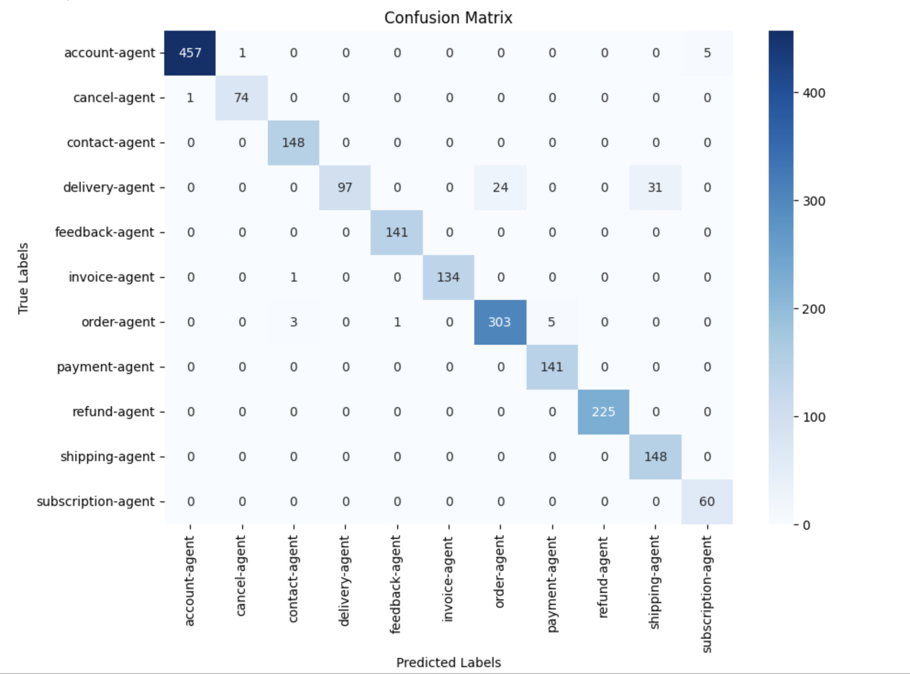
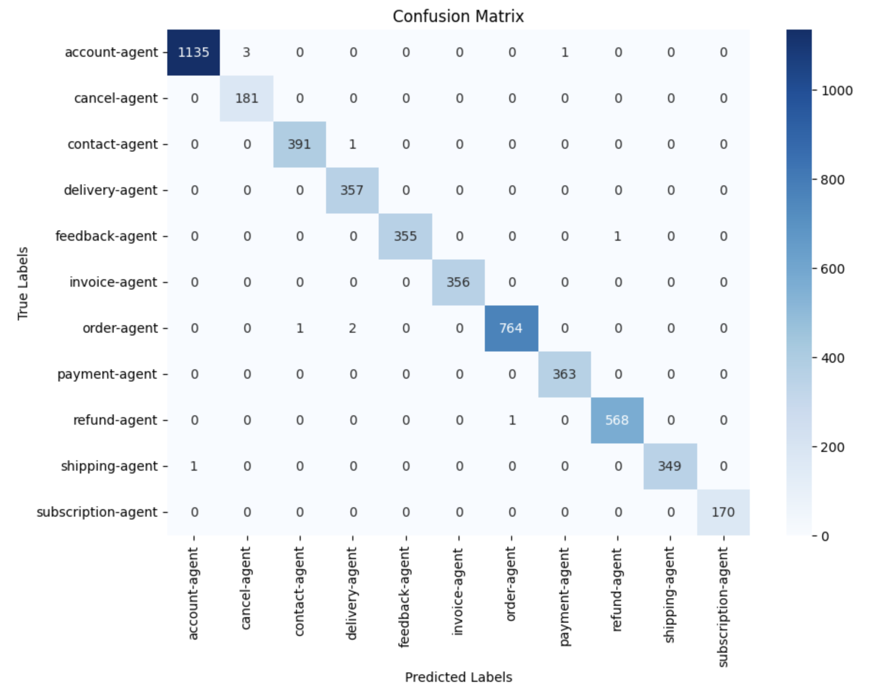

<!--
SPDX-FileCopyrightText: 2023 www.contributor-covenant.org

SPDX-License-Identifier: CC-BY-4.0
-->
[](https://github.com/eclipse-lmos/lmos-router/actions/workflows/gradle.yml)
[](https://github.com/eclipse-lmos/lmos-router/actions/workflows/gradle-publish.yml)
[](https://www.apache.org/licenses/LICENSE-2.0)
[](CODE_OF_CONDUCT.md)

# Intelligent Agent Routing System

## Quickstart Guide

This quickstart guide will help you set up and use the agent routing system. Follow the steps below to get started.

### Step 1: Create Agent Routing Specifications

First, download lmos-router dependency from maven central

```kotlin
implementation("org.eclipse.lmos:lmos-router-llm:x.y.z")
```

then create the agent routing specifications using `SimpleAgentRoutingSpecProvider` and `AgentRoutingSpecBuilder`.

```kotlin
val agentRoutingSpecsProvider = SimpleAgentRoutingSpecProvider()
    .add(
        AgentRoutingSpecBuilder()
            .name("offer-agent")
            .description("This agent is responsible for offer management")
            .version("1.0.0")
            .address(Address(uri = "/agents/offer-agent"))
            .build()
    )
    .add(
        AgentRoutingSpecBuilder()
            .name("service-agent")
            .description("This agent is responsible for service management")
            .version("1.0.0")
            .address(Address(uri = "/agents/service-agent"))
            .build()
    )
```

### Step 2: Initialize the Agent Routing Spec Resolver

Next, initialize the `LLMAgentRoutingSpecsResolver` with the `agentRoutingSpecsProvider`.

```kotlin
val agentRoutingSpecResolver = LLMAgentRoutingSpecsResolver(
    agentRoutingSpecsProvider,
    modelClient = DefaultModelClient(
        DefaultModelClientProperties(openAiApiKey = "your-openai-api-key") //Defaults to System.getenv("OPENAI_API_KEY")
    )
)
```

### Step 3: Pass the Context and User Message

Set up the context and input messages that will be used to resolve the appropriate agent.

```kotlin
val context = Context(listOf(AssistantMessage("Hello")))
val input = UserMessage("Can you help me find a new phone?")
```

### Step 4: Resolve the Agent

Finally, use the `agentRoutingSpecResolver` to resolve the appropriate agent based on the context and input messages.

```kotlin
val result = agentRoutingSpecResolver.resolve(context, input)
```

The `result` should return `offer-agent`, indicating that the "offer-agent" is responsible for handling the user's request. Now you can use the address uri to route the user to the appropriate agent.

For spring cloud gateway, refer to the [Demo](lmos-router-llm-in-spring-cloud-gateway-demo/Readme.md).

## Overview

This project routes user queries to the most suitable agent based on their capabilities using Language Model (LLM), Vector-based approaches, and a new Hybrid approach.

## Table of Contents

1. [Introduction](#introduction)
2. [Routing Methods](#routing-methods)
3. [Modules](#modules)
4. [Benchmarks](#benchmarks)
5. [Setup and Installation](#setup-and-installation)
6. [Demo](#demo)
7. [Contributing](#contributing)
8. [License](#Licensing)

## Introduction

The Intelligent Agent Routing System directs user queries to the best-suited agent based on their capabilities using three methods:

1. **LLM-based approach**: Uses a language model to understand and match queries with agent capabilities.
2. **Vector-based approach**: Uses vector embeddings to find the most similar agent based on the query.
3. **Hybrid approach**: Extracts abstract requirements from the query using an LLM and then searches for an agent using semantic similarity.

## Routing Methods

### LLM-Based Approach

Uses advanced language models like OpenAI's GPT-4o mini to understand the context and semantics of user queries.

**Pros:**
- Understands complex queries and context.
- Flexible and adaptable to various scenarios.
- Utilizes state-of-the-art NLP techniques.

**Cons:**
- Expensive due to commercial language model costs.
- Higher response times.
- Dependent on external APIs with potential rate limits.

### Vector-Based Approach

Uses vector embeddings to represent queries and agent capabilities, comparing them using cosine similarity.

**Pros:**
- Fast and efficient for large-scale data.
- Scalable to handle more agents and queries.
- Independent of external APIs.

**Cons:**
- Limited in understanding complex queries.
- Requires initial setup and regular updates.
- Needs maintenance for embedding updates.

### Hybrid Approach

Extracts abstract requirements from the query using an LLM and then searches for an agent using semantic similarity.

**Pros:**
- Balances the strengths of both LLM and Vector-based approaches.
- Better understanding of complex queries than vector-based alone.
- More efficient than LLM-based alone.

**Cons:**
- Still dependent on external APIs for LLM.
- Requires integration of both LLM and vector-based systems.

### Comparison Table

| Feature                  | LLM-Based Approach | Vector-Based Approach | Hybrid Approach       |
|--------------------------|--------------------|-----------------------|-----------------------|
| Contextual Understanding | High               | Moderate              | High                  |
| Flexibility              | High               | Moderate              | High                  |
| Efficiency               | Moderate           | High                  | High                  |
| Scalability              | Moderate           | High                  | High                  |
| Cost                     | High               | Low                   | High                  |
| Latency                  | Higher             | Lower                 | High                  |
| Dependency               | High               | Low                   | High                  |
| Setup Complexity         | Low                | High                  | High                  |
| Maintenance              | Low                | High                  | High                  |

## Modules

### [Core](lmos-router-core/ReadMe.md)

Contains foundational classes and interfaces:
- **ChatMessage**: Represents different types of chat messages.
- **Context**: Represents the conversation context.
- **AgentRoutingSpec**: Represents agent routing specifications.
- **AgentRoutingSpecsProvider**: Interface for providing agent routing specifications.
- **AgentRoutingSpecsResolver**: Interface for resolving agent routing specifications.
- **Result**: Utility class for handling success and failure cases.

### [LLM](lmos-router-llm/ReadMe.md)

Handles agent routing specifications using a language model:
- **DefaultModelClient**: Client for calling the OpenAI model.
- **LLMAgentRoutingSpecsResolver**: Resolves agent routing specifications using a language model.
- **ModelPromptProvider**: Provides prompts for the language model.

### [Vector](lmos-router-vector/ReadMe.md)

Handles agent routing specifications using vector embeddings:
- **DefaultEmbeddingClient**: Client for embedding text using a local service.
- **OpenAIEmbeddingClient**: Client for embedding text using the OpenAI API.
- **VectorAgentRoutingSpecsResolver**: Resolves agent routing specifications using vector similarity search.
- **VectorSearchClient**: Interface for searching similar vectors.
- **VectorSeedClient**: Interface for seeding vectors.

### [Hybrid](lmos-router-hybrid/ReadMe.md)

Combines LLM and vector-based approaches:
- **HybridAgentRoutingSpecsResolver**: Resolves agent routing specifications using a hybrid approach.

### [LLM Spring boot starter](lmos-router-llm-spring-boot-starter/ReadMe.md)

Spring Boot starter for the LLM-based agent routing system:
- **LLMAgentRoutingSpecsResolverAutoConfiguration**: Auto-configuration for the LLM-based agent routing system.
- **LLMAgentRoutingSpecsResolverProperties**: Configuration properties for the LLM-based agent routing system.
- **LLMAgentRoutingSpecsResolverService**: Service for resolving agent routing specifications.

### [Vector Spring boot starter](lmos-router-vector-spring-boot-starter/ReadMe.md)

Spring Boot starter for the Vector-based agent routing system:
- **VectorAgentRoutingSpecsResolverAutoConfiguration**: Auto-configuration for the Vector-based agent routing system.
- **VectorAgentRoutingSpecsResolverProperties**: Configuration properties for the Vector-based agent routing system.
- **VectorAgentRoutingSpecsResolverService**: Service for resolving agent routing specifications.
- **VectorSeedService**: Service for seeding vectors.
- **VectorSearchService**: Service for searching similar vectors.

### [Hybrid Spring boot starter](lmos-router-hybrid-spring-boot-starter/ReadMe.md)

Spring Boot starter for the Hybrid-based agent routing system:
- **HybridAgentRoutingSpecsResolverAutoConfiguration**: Auto-configuration for the Hybrid-based agent routing system.
- **HybridAgentRoutingSpecsResolverProperties**: Configuration properties for the Hybrid-based agent routing system.
- **HybridAgentRoutingSpecsResolverService**: Service for resolving agent routing specifications.

### [Demo](lmos-router-llm-in-spring-cloud-gateway-demo/Readme.md)

Sample Spring Boot application demonstrating the system:
- **AgentsApplication**: Main application class.
- **AgentsController**: REST controller for handling agent responses.
- **SuperRouteGatewayApplication**: Spring Cloud Gateway application for routing requests.

## [Benchmarks](benchmarks/ReadMe.md)

Evaluates the performance of the LLM-based, Vector-based, and Hybrid resolvers:
- **LLM-based Resolver**: Processes 2000 samples.
- **Vector-based Resolver**: Processes 5000 samples.
- **Hybrid Resolver**: To be added.

Refer to the [Benchmarks](benchmarks/ReadMe.md) for detailed instructions.

### Confusion Matrix and Accuracy

The benchmarks include confusion matrices and accuracy metrics for all methods.

#### LLM-Based Resolver




#### Vector-Based Resolver




## Setup and Installation

You can download the dependencies from maven central by adding the following dependencies to your project:

### LLM-Based Approach Spring Boot Starter

```kotlin
implementation("org.eclipse.lmos:lmos-router-llm-spring-boot-starter:x.y.z")
```

Or using Maven:

```xml
<dependency>
    <groupId>org.eclipse.lmos</groupId>
    <artifactId>lmos-router-llm-spring-boot-starter</artifactId>
    <version>x.y.z</version>
</dependency>
```

### Vector-Based Approach Spring Boot Starter

```kotlin
implementation("org.eclipse.lmos:lmos-router-vector-spring-boot-starter:x.y.z")
```

Or using Maven:

```xml
<dependency>
    <groupId>org.eclipse.lmos</groupId>
    <artifactId>lmos-router-vector-spring-boot-starter</artifactId>
    <version>x.y.z</version>
</dependency>
```

### Hybrid Approach Spring Boot Starter

```kotlin
implementation("org.eclipse.lmos:lmos-router-hybrid-spring-boot-starter:x.y.z")
```

Or using Maven:

```xml
<dependency>
    <groupId>org.eclipse.lmos</groupId>
    <artifactId>lmos-router-hybrid-spring-boot-starter</artifactId>
    <version>x.y.z</version>
</dependency>
```

### No framework dependencies

If you are not using Spring Boot, you can add the following dependencies:

#### LLM-Based Approach

```kotlin
implementation("org.eclipse.lmos:lmos-router-llm:x.y.z")
```

#### Vector-Based Approach

```kotlin
implementation("org.eclipse.lmos:lmos-router-vector:x.y.z")
```

#### Hybrid Approach

```kotlin
implementation("org.eclipse.lmos:lmos-router-hybrid:x.y.z")
```

or you can build the project from source:

1. **Clone the repository**:

```bash
git clone https://github.com/eclipse-lmos/lmos-router.git
cd lmos-router
```

2. **Set environment variables**: (If running Flow tests, they can be enabled by setting gradle project property `runFlowTests=true`)
   - `OPENAI_API_KEY`: Your OpenAI API key.
   - `VECTOR_SEED_JSON_FILE_PATH`: Path to the JSON file containing seed vectors.

3. **Build the project**:

```bash
./gradlew build
```

## Demo

To run the demo:

Refer to the [Demo](lmos-router-llm-in-spring-cloud-gateway-demo/Readme.md) for detailed instructions.

## Contributing

Contributions are welcome! Please read the [contributing guidelines](Contributing.md) for more information.

## Code of Conduct

This project has adopted the [Contributor Covenant](https://www.contributor-covenant.org/) in version 2.1 as our code of conduct. Please see the details in our [CodeOfConduct.md](CodeOfConduct.md). All contributors must abide by the code of conduct.

By participating in this project, you agree to abide by its [Code of Conduct](./CodeOfConduct.md) at all times.

## Licensing
Copyright (c) 2025 Deutsche Telekom AG and others.

Sourcecode licensed under the [Apache License, Version 2.0](https://www.apache.org/licenses/LICENSE-2.0) (the "License"); you may not use this project except in compliance with the License.

This project follows the [REUSE standard for software licensing](https://reuse.software/).    
Each file contains copyright and license information, and license texts can be found in the [./LICENSES](./LICENSES) folder. For more information visit https://reuse.software/.   

Unless required by applicable law or agreed to in writing, software distributed under the License is distributed on an "AS IS" BASIS, WITHOUT WARRANTIES OR CONDITIONS OF ANY KIND, either express or implied. See the LICENSE for the specific language governing permissions and limitations under the License.
