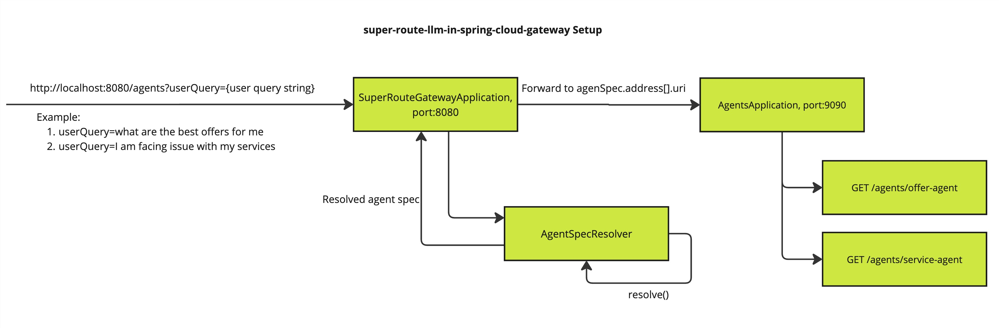

<!--
SPDX-FileCopyrightText: 2023 www.contributor-covenant.org

SPDX-License-Identifier: CC-BY-4.0
-->
# lmos-router-llm-in-spring-cloud-gateway

This project demonstrate the usage of super route core
abstraction [AgentRoutingSpecsResolver](https://github.com/lmos-ai/lmos-router/blob/main/lmos-router-core/src/main/kotlin/ai/ancf/lmos/router/core/AgentRoutingSpecsResolver.kt)

## Demonstration Setup View



## Steps to run the demo
1. Configure environment variable OPENAI_API_KEY={YOUR_API_KEY}
2. Boot up `SuperRouteGatewayApplication` on port:8080 
3. Boot up `AgentsApplication` on port:9090 with option: `-Dserver.port=9090`
4. Now ask queries to the gateway on either of the categories = offers or service.
As per the intent in the user query the request will be forwarded by the gateway to either of the endpoint
`http://localhost:9090/agents/offer-agent` or `http://localhost:9090/agents/service-agent`

## Examples to test setup 
```
curl --location 'http://localhost:8080/agents?userQuery=I%20have%20some%20issue%20with%20my%20services'
```
```
curl --location 'http://localhost:8080/agents?userQuery=what%20are%20the%20best%20offers%20for%20me'
```

## Configuration Used

### AgentRoutingSpecsProvider

[AgentRoutingSpecsProvider](https://github.com/lmos-ai/lmos-router/blob/main/lmos-router-core/src/main/kotlin//ai/ancf/lmos/router/core/AgentRoutingSpecsProvider.kt)
has been configured with `SimpleAgentRoutingSpecProvider`
```
SimpleAgentRoutingSpecProvider().add(
            AgentRoutingSpecBuilder().name("offer-agent").description("This agent is responsible for offer management")
                .version("1.0.0").address(Address(uri = "/agents/offer-agent")).build()
        )
            .add(
                AgentRoutingSpecBuilder().name("service-agent").description("This agent is responsible for service management")
                    .version("1.0.0").address(Address(uri = "/agents/service-agent")).build()
            )
```

### AgentRoutingSpecsResolver

`LLMAgentRoutingSpecResolver` has been used to resolve Agent Spec.

Refer `GatewayConfiguration` for more details.